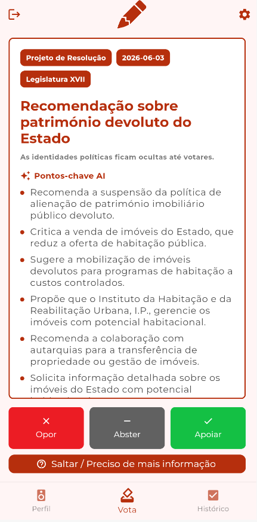
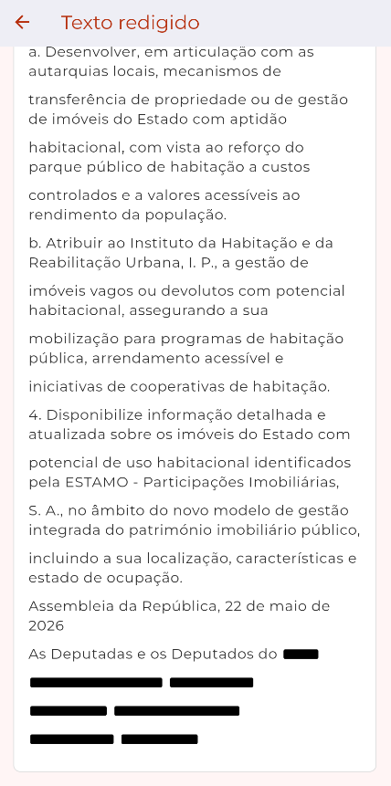
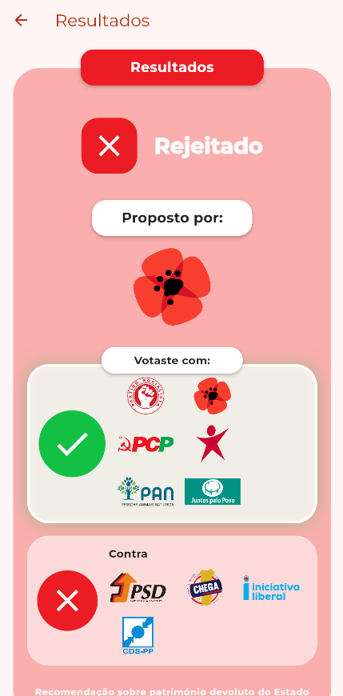
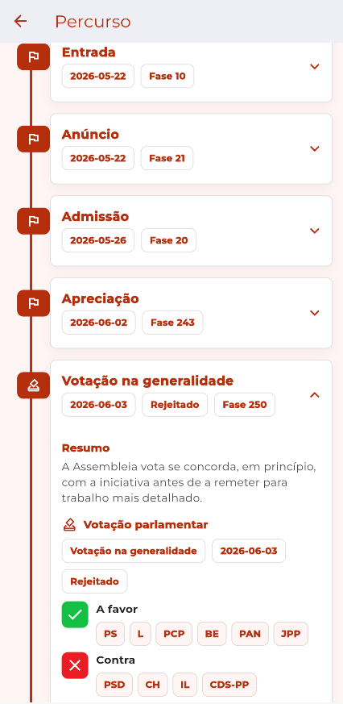
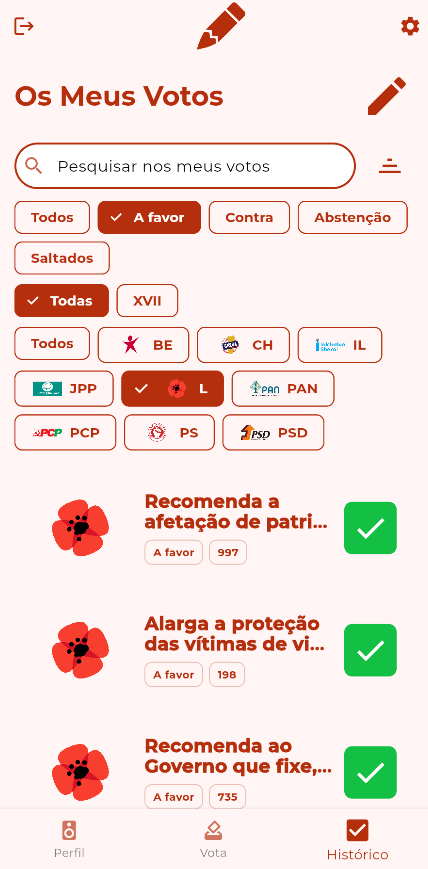
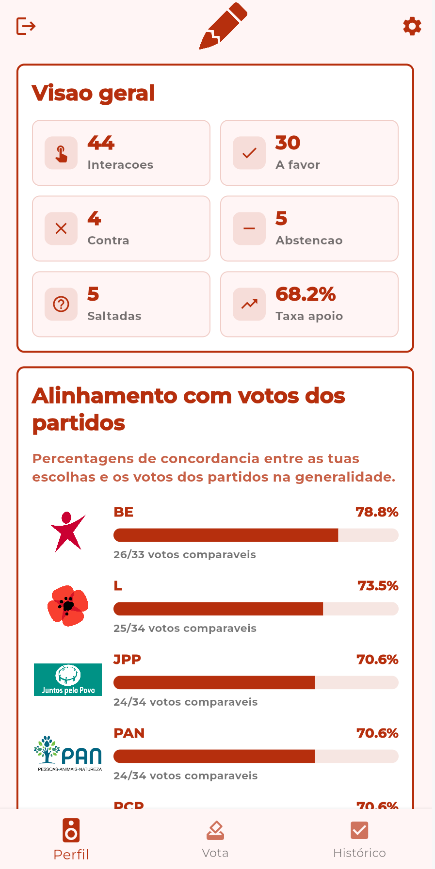
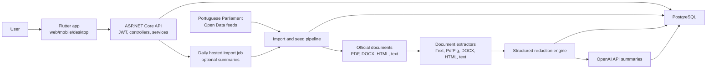

# Parlamento

[](https://flutter.dev)
[](https://dotnet.microsoft.com)
[](https://www.postgresql.org)
[](https://www.docker.com)
[](https://github.com/features/actions)

Parlamento is a civic-tech application for exploring Portuguese parliamentary initiatives without seeing the party label first.

**Live demo:** [parlamento-app.pages.dev](https://parlamento-app.pages.dev/)

Portuguese parliamentary proposals are often long, legalistic, and heavily shaped by party identity. Parlamento asks a simple question: what happens if people react to an initiative on its merits before discovering who proposed it?

The app shows an anonymised proposal card with redacted official text and optional AI-generated summaries. Users can support, oppose, abstain, or skip. Only after voting does the app reveal the proposer, Parliament's generality vote, party vote breakdowns, official sources, and the initiative's legislative journey.



## Motivation

Parliament data is public, but public does not always mean approachable. Official initiative records combine legal text, procedural stages, committee documents, party votes, publications, and debate links in formats that are hard to browse casually.

Parlamento turns that information into a guided flow:

- read a neutral, anonymised proposal card;
- react before party identity is revealed;
- compare your reaction with Parliament's official vote;
- follow the initiative through its parliamentary lifecycle;
- revisit your voting history and profile statistics.

The project is technically interesting because it combines product design, source-data ingestion, document extraction, redaction, AI summarisation, and a full-stack mobile/web client into one end-to-end civic information system.

## Features

| Area                          | Implemented capability                                                                                                                                     |
| ----------------------------- | ---------------------------------------------------------------------------------------------------------------------------------------------------------- |
| Anonymous browsing            | Feed cards intentionally omit proposer identity, party votes, and final result before the user votes.                                                      |
| AI summaries                  | OpenAI-backed summaries are generated from redacted official text and stored with model, prompt version, source hash, status, and timestamps.              |
| Redacted proposal text        | Official initiative documents are extracted, redacted, rendered to structured HTML, and shown in Flutter with inline redaction blocks.                     |
| Vote flow                     | Users can support, oppose, abstain, or skip an initiative. Skip is stored separately from political abstention.                                            |
| Party reveal                  | After voting, the app reveals proposer identity and Parliament's generality vote.                                                                          |
| Parliament vote comparison    | Party vote blocks are parsed from official vote details, including counts, abstentions, absences, unanimous votes, and split-party indicators.             |
| Proposal journey timeline     | A dedicated timeline view shows phases, votes, official documents, Diario links, debate transcripts, and video links where imported.                       |
| Previous votes history        | History is paginated, searchable, and filterable by interaction type, legislature, and proposing party.                                                    |
| Profile statistics            | Profile overview tracks interactions, support/oppose/abstain/skip counts, support rate, skip rate, and party alignment once enough comparable votes exist. |
| Authentication                | Email/password, Google, and Facebook login issue a local JWT app session used by protected endpoints.                                                      |
| Open Data integration         | The backend imports Portuguese Parliament Open Data initiative and base-info feeds for configured legislatures.                                            |
| Incremental import pipeline   | Imports are tracked with run records, source hashes, inserts, updates, skips, and per-record errors.                                                       |
| PDF/DOCX/HTML/text extraction | Initiative text documents are downloaded and converted into an internal structured document model.                                                         |
| Redaction engine              | Party, parliamentary group, deputy, author, email, URL, and domain cues are redacted before text reaches the anonymous card.                               |
| Scheduled import pipeline     | A hosted daily seed service can run the latest-legislature import, redaction, and optional summaries when enabled by configuration.                        |

## Screenshots

Screenshots are intentionally placeholders. Capture real screenshots from a seeded local or deployed environment and save them in `docs/screenshots/`.

### Anonymous Proposal Card


### Redacted Text Reader



### Party Reveal



### Proposal Journey



### Previous Votes History



### Profile Statistics



## Architecture

Parlamento is split into a Flutter client and an ASP.NET Core API backed by PostgreSQL.



### Frontend

The frontend is a Flutter application using Provider-based session state, a small repository/API-client layer, secure token storage, and Material UI.

Implemented screens include login/register, the anonymous voting card, redacted text reader, reveal screen, proposal journey timeline, previous votes history, and profile statistics.

### Backend

The backend is a .NET 8 ASP.NET Core API organized into:

- `src/` for controllers, startup, Swagger, health checks, and command-mode entry points;
- `Application/` for request/response contracts, validators, and service interfaces;
- `Domain/` for entities, document models, and enums;
- `Infrastructure/` for EF Core persistence, PostgreSQL migrations, auth, import, redaction, document extraction, summaries, and hosted jobs.

The API exposes JWT-protected endpoints for proposal flow, voting, profile, proposal CRUD, parties, users, and parliament import operations.

### Data Pipeline

The import pipeline reads configured Parliament Open Data feeds, supports object-root and array-root JSON, streams large arrays, skips initiatives without a usable phase `250` generality vote, and upserts by source id/source hash.

Imported source traceability includes authors, events, votes, vote blocks, documents, publications, interventions, Diario links, and video links. The document pipeline then extracts initiative text documents, redacts identity cues, stores redacted plain text and HTML, and optionally generates neutral European Portuguese summaries with OpenAI.

## Interesting Technical Challenges

### Anonymous Civic UX

The feed response deliberately excludes proposer identity, official result, and party vote data. The reveal endpoint refuses to show results until a comparable user vote exists. This makes anonymity an application contract, not only a frontend convention.

### Open Data Ingestion

Parliament initiative feeds contain nested events, votes, attachments, publications, interventions, and multiple initiative types. The importer preserves the source graph while still mapping the fields needed by the app's voting flow.

### Incremental Imports

Each run records read/insert/update/skip/fail counts. Source hashes avoid unnecessary rewrites, while unchanged rows are skipped and failures are stored without aborting the whole batch.

### Vote Detail Parsing

Official vote details arrive as loose HTML-ish text with sections such as "A Favor", "Contra", "Abstencao", and "Ausencias". The parser normalizes labels, extracts party acronyms and deputy counts, handles unanimous votes, and marks split parties as non-unanimous.

### PDF and Document Extraction

Parliament documents are not uniform. The backend supports PDF, DOCX, HTML, and plain text extraction into a shared `ParliamentDocumentModel`. iText is the production PDF extractor, while PdfPig remains available for comparison and regression work.

### Structured Redaction

Instead of simple string deletion, documents are converted into semantic blocks and runs. Redactions become model runs and render as stable inline HTML spans, preserving enough layout for users to read the text while hiding identity cues.

### AI Summaries With Auditability

Summaries are generated only from redacted text. Stored metadata includes model name, prompt version, source document hash, status, errors, and generation timestamp, making stale summaries identifiable when prompts, models, or source text change.

### Timeline Reconstruction

The journey page reconstructs a proposal lifecycle from imported events and votes. It keeps generality, speciality, final-global, post-approval, publication, documents, Diario links, debate transcripts, and videos in one progressively disclosed timeline.

## Tech Stack

| Layer            | Technology                                          | Where it is used                                                         |
| ---------------- | --------------------------------------------------- | ------------------------------------------------------------------------ |
| Frontend         | Flutter                                             | Cross-platform client and web build.                                     |
| Frontend         | Dart                                                | UI, state, API client, models, tests.                                    |
| Backend          | ASP.NET Core / .NET 8                               | REST API, JWT auth, hosted service, command-mode jobs.                   |
| Backend          | Entity Framework Core                               | Persistence and migrations.                                              |
| Database         | PostgreSQL 16                                       | Primary local and production database target.                            |
| Local dev        | Docker / Docker Compose                             | PostgreSQL, migration container, dev/prod backend and frontend services. |
| CI/CD            | GitHub Actions                                      | Pull-request lint/test workflows and development deployments.            |
| AI               | OpenAI API                                          | Neutral legislative summaries from redacted text.                        |
| Hosting          | Cloudflare Pages                                    | Flutter web deployment in the frontend workflow.                         |
| Hosting          | Fly.io                                              | ASP.NET backend deployment.                                              |
| Database hosting | Neon PostgreSQL                                     | Production/development migration target via CI secret.                   |
| Documents        | iText                                               | Production selectable-text PDF extraction.                               |
| Documents        | PdfPig                                              | PDF extraction comparison and regression tooling.                        |
| Documents        | Open XML / ZIP parsing                              | DOCX extraction.                                                         |
| Auth             | Google Sign-In / Facebook Auth / JWT                | Provider login plus local signed app sessions.                           |
| Quality          | xUnit, flutter_test, dotnet format, flutter analyze | Backend and frontend tests/linting.                                      |

## Running Locally

### Prerequisites

- Docker and Docker Compose
- Flutter SDK for non-Docker frontend development
- .NET SDK 8.0 for non-Docker backend development
- PostgreSQL client tools, optional but useful
- OpenAI API key, optional unless you want to generate summaries

### Environment Variables

Create a root `.env` file for Docker Compose overrides when needed:

```bash
PARLAMENTO_DB_NAME=parlamento
PARLAMENTO_DB_USER=parlamento
PARLAMENTO_DB_PASSWORD=parlamento

OPENAI_API_KEY=
OPENAI_MODEL=gpt-4o-mini-2024-07-18

PARLIAMENT_OPEN_DATA_LATEST_LEGISLATURE=XVII
PARLIAMENT_OPEN_DATA_DAILY_IMPORT_ENABLED=false
PARLIAMENT_OPEN_DATA_DAILY_IMPORT_RUN_SUMMARIES=true
```

For the Flutter app, create `frontend/.env`:

```bash
BACKEND_URL=http://localhost:8180
GOOGLE_CLIENT_ID=
FACEBOOK_APP_ID=
```

The frontend `.env` is bundled into the client and must only contain public client-side configuration.

### Start With Docker

```bash
docker compose up postgres-parlamento db-parlamento-migrate dev-parlamento-be dev-parlamento-fe
```

Local URLs:

| Service      | URL                                        |
| ------------ | ------------------------------------------ |
| Flutter web  | `http://localhost:3000`                    |
| Backend API  | `http://localhost:8180`                    |
| Swagger UI   | `http://localhost:8180/swagger/index.html` |
| Health check | `http://localhost:8180/healthz`            |
| PostgreSQL   | `localhost:5432`                           |

### Apply Migrations

```bash
docker compose up db-parlamento-migrate
```

Without Docker:

```bash
cd backend
dotnet restore
dotnet ef database update --project Infrastructure --startup-project src
```

Set `ConnectionStrings__DefaultConnection` first if you are using a local PostgreSQL instance outside Docker.

### Seed Parliament Data

Run the full backend data pipeline:

```bash
dotnet run --project backend/src -- parliament-seed --legislatures XVII --max-documents 25 --no-summary
```

Generate summaries after redaction, if `OPENAI_API_KEY` is configured:

```bash
dotnet run --project backend/src -- parliament-summary --legislature XVII --all-unprocessed
```

Useful one-shot commands:

```bash
dotnet run --project backend/src -- parliament-import --legislatures XVII
dotnet run --project backend/src -- parliament-import --file docs/samples/example_iniciativa.json
dotnet run --project backend/src -- parliament-documents redact --legislature XVII --max-documents 25
dotnet run --project backend/src -- parliament-documents compare-pdf-extractors --file C:\path\proposal.pdf
```

### Run Backend Without Docker

```bash
cd backend
dotnet restore
dotnet run --project src
```

### Run Frontend Without Docker

```bash
cd frontend
flutter pub get
flutter run -d chrome --web-port 3000
```

### Tests

```bash
dotnet test backend/test/test.csproj
dotnet test backend/integration-tests/integration-tests.csproj

cd frontend
flutter analyze
flutter test
```

## Deployment

The repository contains development deployment workflows for a production-like split architecture:

| Component            | Platform         | Workflow                                                                                                                                                   |
| -------------------- | ---------------- | ---------------------------------------------------------------------------------------------------------------------------------------------------------- |
| Flutter web frontend | Cloudflare Pages | `.github/workflows/frontend_dev.yml` builds Flutter web and deploys `frontend/build/web` to [parlamento-app.pages.dev](https://parlamento-app.pages.dev/). |
| ASP.NET Core backend | Fly.io           | `.github/workflows/backend_dev.yml` tests, migrates, and deploys the backend using `flyctl`.                                                               |
| PostgreSQL           | Neon             | Backend workflow applies EF Core migrations using `NEON_CONNECTION_STRING`.                                                                                |

The backend workflow runs on pushes to `development` that touch backend files. It restores, builds, tests against PostgreSQL, applies EF Core migrations to Neon, and deploys to Fly.io.

The frontend workflow runs on pushes to `development`, creates the Flutter `.env` from repository secrets, analyzes, tests, builds the web app, and deploys to Cloudflare Pages.

Pull requests also run separate backend and frontend lint/test workflows.

## Project Structure

```text
.
+-- backend/
|   +-- src/                  # ASP.NET Core API, controllers, command entry points
|   +-- Application/          # DTOs, validators, service interfaces
|   +-- Domain/               # Entities, enums, structured document model
|   +-- Infrastructure/       # EF Core, services, migrations, import/redaction/summaries
|   +-- test/                 # Backend unit tests
|   +-- integration-tests/    # API and pipeline integration tests
+-- frontend/
|   +-- lib/                  # Flutter app, pages, controllers, models, widgets
|   +-- test/                 # Flutter tests
|   +-- web/                  # Web shell and PWA metadata
+-- docs/
|   +-- samples/              # Parliament Open Data sample fixtures
|   +-- wireframes/           # Product flow wireframes and notes
|   +-- *.md                  # Development, auth, product flow, scraper migration docs
+-- .github/workflows/        # CI/CD workflows
+-- docker-compose.yml        # Local PostgreSQL, migration, backend, frontend services
```

## Roadmap

### Implemented

- Anonymous proposal feed cards
- Redacted official text reader
- Support, oppose, abstain, and skip interactions
- Post-vote party reveal
- Parliament generality vote comparison
- Proposal journey timeline
- Previous votes history with search, filters, and pagination
- Profile overview and party alignment statistics
- Email/password, Google, Facebook, and JWT app sessions
- Portuguese Parliament Open Data importer
- Base-info importer for deputies and parliamentary groups
- Document extraction and structured redaction
- OpenAI summary generation from redacted text
- Daily hosted latest-legislature seed job, disabled by default
- Docker Compose local stack
- GitHub Actions test/lint/deploy workflows

### Planned

- OCR support for scanned-image PDFs
- Stronger session hardening with refresh tokens or server-side revocation
- More advanced feed ranking and diversification
- User-facing summary/redaction feedback or correction flow
- Better topic/category analytics
- Additional visual polish and accessibility passes across the Flutter UI
- A formal license file

## Contributing

Contributions are welcome. Good first areas include tests, UI polish, importer edge cases, redaction examples, documentation, and deployment hardening.

Recommended workflow:

```bash
git checkout -b feature/short-description
dotnet test backend/integration-tests/integration-tests.csproj
cd frontend && flutter test
```

Before opening a pull request, run the relevant tests and keep changes scoped. For data-pipeline work, include a small fixture or regression test whenever possible.

## License

No license file is currently present in the repository. Add one before distributing or accepting external contributions under a defined open-source license.
