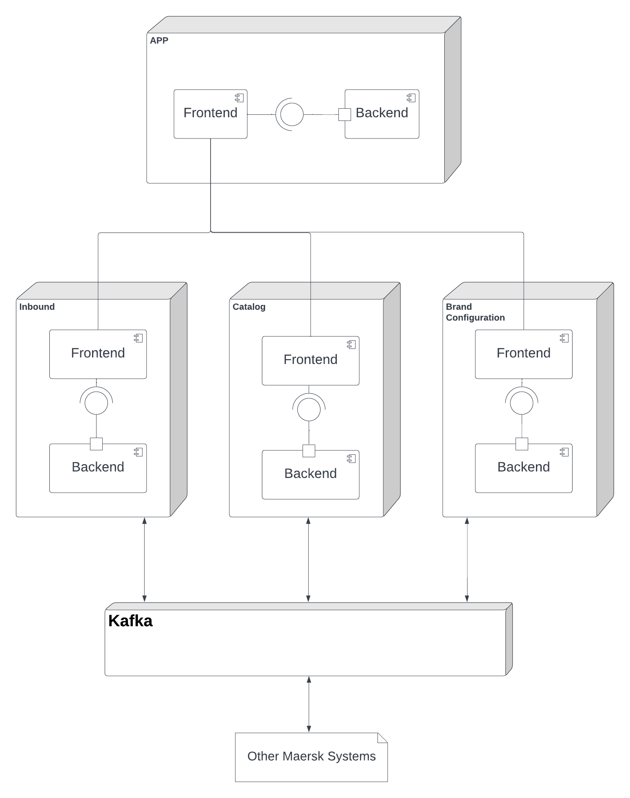

# Development

## Architecture and design

The current architecture consists of one main application that interacts with 3 different microservices:

- Inbound
- Catalog
- Brand configuration

Each microservice is composed by two components, the frontend and the backend. The frontend of the microservice can only access the backend of its own microservice and the base app only integrates each microservice's frontend into its own frontend. Each microservice can eventually communicate with other microservices using the Kafka messaging system.

Integrating new services as a component of existing ones could lead to disruptive behavior in the overall product. By building these services independently, the failure of one of them does not directly impact the rest of the system. As such, we handle each of the new features as independent microservices. Doing so makes the system more resilient while guaranteeing the system's scalability for future services. 

## Technology

It was our PO's goal that the implemented system is scalable, maintainable and reliable, which is why the microservices do not communicate directly via REST and do instead via `Apache Kafka` messages that share a common protocol. The latter was imposed by the PO so that the developed services' event system is compatible with the company's current one.

For a microservice frontend, we're using `Flutter`. That was not our choice, either; we feel that Flutter web support is still in its infancy and a well-established, well-known technology like `ReactJS` or `VueJS` could have been used instead. We, on the other hand, recognize the potential in Flutter for growth in the years to come and the interest in mobile-first development and understood the company's decision.

For a microservice backend, we're using `ASP.NET`, a framework on top of `.NET` for building web applications, which was also requested by the PO. Although new for the team, we understood the advantages of `C#` over the older `Java` (in the likes of `Spring`), such as easier to read syntax and great features such as auto generated getters and setters. It is a solid environment for building APIs.

For the DMBS, after some internal team discussion and the teacher's input on the matter, we went with `SQLite` given its simplicity and compliance with standard SQL, which has proven to be solid for years. Since we are using an ORM (provided by `.NET`'s `Entity Framework Core`) for managing the database in a code-first fashion, and each microservice encapsulates a small-schema, system-agnostic database, we felt that the likes of `PostgresSQL` were not the right tool for the job.

Since all these tools need to be configured in one's machine at the same time for full-stack development, we containerized each microservice with `Docker Compose` to allow for a easier, more consistent development experience across machines.

This setup is replicated across the microservices in a consistent way since we have put a generic application scaffolding in a [template repository](https://github.com/FEUP-MEIC-DS-2022-1MEIC01/microservice-template).

## Development guide
<!--
Explain what a new developer to the project should know in order to develop the system, including who to build, run and test it in a development environment.

Document any APIs, formats and protocols needed for development (but don't forget that public APIs should also be accessible from the "How to use" section in your README.md file).

Describe coding conventions and other guidelines adopted by the project.
-->

#### Branching strategy and Pull-Request Policy

The version-control system will also follow a convention concerning the branching strategy. The used branching strategy will be `GitFlow`.

`GitFlow` has the following types of branches:

|Branch Name| Branch Type |Description | Naming Convention |
|-|-|-|-|
|`main`|Single Branch|Contains the latest stable version of the project.| `main`|
|`develop`|Single Branch|Contains the current global working version of the project.| `develop` |
|`feature`|Auxiliary Branch|Contains a working version of a new feature.|`feature/name-of-feature`|
|`fix`| Auxiliary Branch | Contains a working version on a bugfix.|`fix/name-of-fix`|
|`hotfix`|Auxiliary Branch|Contains a working version on a hotfix for a stable version.|`hotfix/name-of-fix`|
|`release`|Auxiliary Branch|Contains a working version which is helping to prepare for a new production release. |`release/name-of-release`|

Single Branches (`main` and `develop`) have an infinite lifetime and are unique. There can be as many Auxiliary Branches as needed, and their lifetime is limited to the end of the task they are responsible for. For example, `feature/dashboard-dropdown` is alive until the dashboard's dropdown is finished and the branch is merged with develop.

`main` contains the latest stable version of the project and thus the default branch. `develop` is the main development branch, and thus the most up-to-date working version of the project. `feature` and `fix` branches branch out from and are merged back to `develop`. `release` branches also branch out from `develop` and are merged back to `develop` but also to `main`. `hotfix` branches branch out from `main` and are merged back to both `develop` and `main`.

For reference, each User Story should branch out of `develop` in a `feature` branch. Work items should branch out from and be merged back to the `feature` branch of the associated User Story.

#### Releases

On each release to the `main` branch, a `GitHub` release will also be made describing notable changes, the contributors and significant assets (if applicable). This release's name will follow the Sprint number: for Sprint 1, the release will be named `1.0`. Any following hotfixes will add up on the second number - that is, the first hotfix on the first release will be named `1.1`. 

*Pull requests* should also be reviewed by at least two team members before merging. This reviews should be done with the utmost attention to ensure that the code is correct, clean, clear and maintainable.

#### Commit Message Standard

Commit messages should also follow a well-defined structure. As for basic rules, the commit messages:

 - Should not end the subject line with a period
 - Should capitalize the subject line and each paragraph
 - Should use the imperative mood in the subject line
 - Should wrap lines at 72 characters
 - Should use the body (if needed) to explain what and why you have done something. In most cases, you can leave out details about how a change has been made.
  - Should separate subject from body with a blank line (if the body is present)

For other commit guidelines check [this page](https://gist.github.com/robertpainsi/b632364184e70900af4ab688decf6f53).

#### Coding Conventions

As for coding conventions, we're using two different linters for each microservice's backend and frontend, respectively. For the backend, we're using Microsoft's standard *code-style* for `.NET`. For the frontend, we're using Google's standard *code-style* for `Flutter`. 

`GitHub Actions` were set up to run these linters. As such, for a *pull request* to be accepted, the actions must pass, meaning that the code must properly follow the defined conventions.

## Security concerns

Identify potential security vulnerabilities classes and explain what the team has done to mitigate them.

## Quality assurance

Describe which tools are used for quality assurance and link to relevant resources. Namely, provide access to reports for coverage and mutation analysis, static analysis, and other tools that may be used for QA.

## Metrics

Describe how you captured each of the "four key metrics" (e.g., automatic mechanism, survey to the team on the end of each sprint).

Provide here an historical record (for each sprint) of the four key metrics and velocity.

## Restrospectives

Describe (possibly as separate markdown files linked form this section) a written account of your retrospectives. There should be, for each sprint, one retrospective for the entire project, and one for each team.
