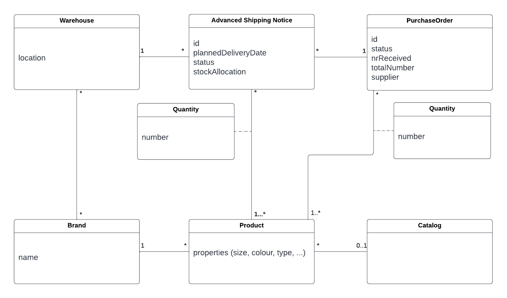

# Product Management

## Product Vision

<!--- Explain in few paragraphs what is the product vision that will guide the development of your product. Keep within ~1500 characters and user as reference the _Vision_ pattern in [The Scrum Book](http://scrumbook.org/). -->

For MAERSK's clients, who want MAERSK to support their entire logistics operation. The Ecommerce Logistics API is an API that gives more control to clients and visibility on theirs operations. The API combines multiple services such as catalog and purchase orders' management and brand configuration.  

## Market Research

<!--- Survey of similar projects and analysis of their pros and cons when compared to the product to be developed. -->

To get an idea about how strong the competition is and where are we in regard to that competition we can rely on the [“Magic Quadrant"]( https://www.gartner.com/en/research/methodologies/magic-quadrants-research) for Third-Party Logistics, Worldwide by Gartner. 

 As we can see in terms of “ability to execute” Maersk manages to be in the “Challengers” quadrant even though there is room for improvement. Yet, in terms of “completeness of vision” its performance in comparison with the competition is lagging and a lot needs to be done to catch the best competitors in the game. Arguably, the main driver for this factor is the digital strategy of the logistic platform.

For a more detailed analysis we delve into two e-commerce fulfilment platforms : Fulfillment By Amazon and Rakuten Super Logistics.

Below we have some positive and negative points of the platforms, as well as the comparison with the product to be developed.

### Fulfillment By Amazon

#### Pros

- Orders can automatically have a Prime badge and eligible for Prime free shipping and delivery times.
- Fulfillment to ship orders placed on eBay, Shopify, and others without using another third party.
- Customers don't need to worry about running out of storage, so they can scale very easily.

#### Cons

- Expensive fulfillment
- High storage costs
- The brand has to enforce Amazon’s no-questions-asked return policy.

### Rakuten Super Logistics

#### Pros

- Integrated marketing services
- 1-day order fulfillment
- Order consolidation, which means this fulfillment company can consolidate multiple orders into one shipment to save you on shipping costs

#### Cons

- High minimums
- Reports of slow customer service

Bearing in mind the information we currently have about the product to be developed and its business model, we believe that it may stand out in relation to other platforms in the following points:

- To be part of a major player in the logistics area such as maersk
- Enable all end-to-end product management with all the necessary logistical support
- Simplicity in management and obtaining detailed information
- Tracking of all documents necessary for transport
- Enables full digitization of the supply chain of our brands

## Domain Analysis

<!--Include high-level class diagram with key domain concepts. Complement this diagram with other high-level diagrams has appropriate (activity, sequence, etc.).-->

### Domain Model

The Catalog is a collection of Products that the brands upload and maintain. A Product is described by its properties *with operational impact* - such as package dimensions, weight or danger of transportation - and those *without operational impact* - colour, type, collection, etc. \
As for the inbound, a purchase order is an order made by a brand to a specific supplier of a list of products. A purchase order contains then one or more advanced shipping notices that detail a list of a certain portion of products to be delivered as well as their planned delivery date, the warehouse they should be delivered to and the stock allocation for them. A purchase order can be open, in progress, archived or cancelled and an Advanced Shipping Notice can be booked, cancelled, pending or received.\
Regarding Brand Configurations, each brand's preferences regarding return policies, fulfillment/delivery policies and Warehouses for product storage are set up with Maersk and occasionally modified. A Warehouse can be visualized by its geographical location.

